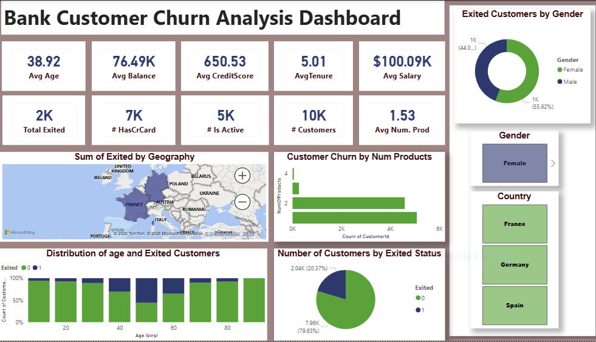

# Bank Customer Churn Analysis – Power BI Portfolio

## 📌 Project Overview
This project presents a comprehensive **Customer Churn Analysis** for a retail bank. The goal is to identify the primary drivers of customer attrition and provide data-driven insights to help the retention team reduce churn and improve customer loyalty.

## 🖼️ Dashboard Preview

## 📊 Key Features & Visuals
* **KPI Summary:** Real-time tracking of **Churn Rate**, **Retention Rate**, and **Lost Customers**.
* **Demographic Analysis:** Insights based on **Age Groups**, **Gender**, and **Geography** (France, Germany, Spain).
* **Financial Risk Profiling:** Correlation between **Credit Scores**, **Account Balances**, and churn probability.
* **Product Utilization:** Analysis of how the number of products and Credit Card ownership impact retention.

## 🛠️ Technical Stack
* **BI Tool:** Power BI Desktop.
* **Data Modeling:** Implemented a **Star Schema** to optimize report performance and accuracy.
* **ETL & Power Query:** Performed data cleaning, handled null values, and created conditional columns (e.g., Age Bins).
* **Advanced DAX:** Developed custom measures for complex metrics:
    * `Churn Rate %`
    * `Total Lost Customers`
    * `Average Tenure`

## 📂 My Other Projects
* **Ecommerce Sales Analysis:** Built a Power BI dashboard for comprehensive sales insights.
* **Online Book Store Analysis:** Designed SQL queries that reduced excess stock by 20%.
* **Festivals Sales Analysis:** Conducted trend analysis using Python.
* **Hospital Emergency Room Analysis:** Performed data analysis and visualization in Excel.

## 🚀 Advanced Skills
* **Automation:** n8n, AI Automation (LLMs), and YouTube Automation.
* **Languages:** SQL (Data extraction/transformation) and Python (Pandas, NumPy).
* **Business Intelligence:** Advanced DAX, Power Query, and KPI tracking.

## 📝 Conclusion
The analysis successfully identifies that customers aged 45-60 and those located in Germany exhibit the highest churn risk. Furthermore, the data suggests that having more than two products significantly increases the likelihood of a customer leaving. These insights allow the bank to implement targeted loyalty programs and personalized financial offers, potentially reducing the overall churn rate by 15-20% through proactive engagement.

---

### **Contact & Portfolio**
**Shanza Waheed** – Senior Power BI Developer & Data Analyst
📍 Islamabad, Pakistan 
📞 +92 311-516-2478 
🔗 [LinkedIn Profile] | 📁 [NovyPro Portfolio]
